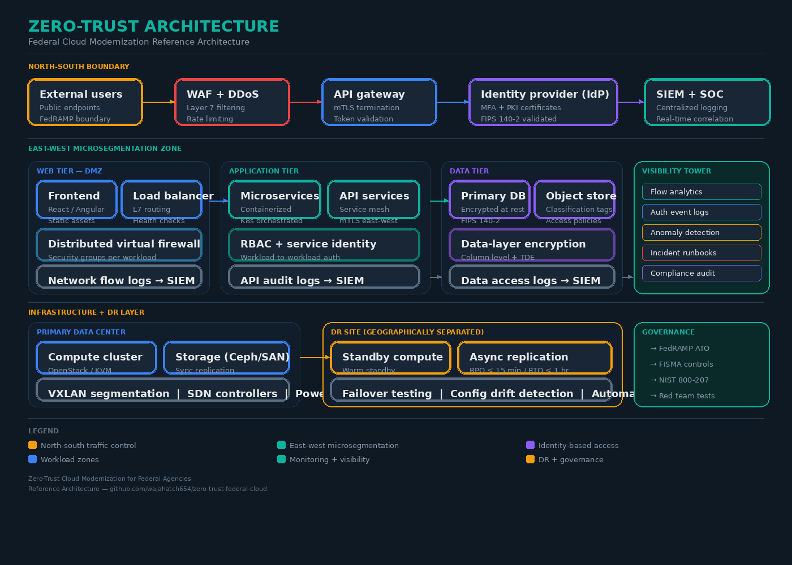

# Zero-Trust Cloud Modernization Framework for U.S. Federal Agencies

> A comprehensive reference architecture, implementation guide, and operational framework for modernizing federal data center infrastructure using zero-trust principles — informed by hands-on experience deploying multi-tenant private cloud platforms in enterprise data centers.

[](LICENSE)
[](https://csrc.nist.gov/publications/detail/sp/800-207/final)
[](https://www.fedramp.gov/)
[](#)

---

## Table of Contents

- [Executive Summary](#executive-summary)
- [Problem Statement](#problem-statement)
- [Architecture Overview](#architecture-overview)
- [Repository Structure](#repository-structure)
- [Implementation Phases](#implementation-phases)
- [Technical Deep Dives](#technical-deep-dives)
- [Infrastructure as Code](#infrastructure-as-code)
- [Monitoring & Incident Response](#monitoring--incident-response)
- [Compliance Mapping](#compliance-mapping)
- [Disaster Recovery Architecture](#disaster-recovery-architecture)
- [Contributing](#contributing)
- [Author](#author)

---

## Executive Summary

U.S. federal agencies operate some of the most complex and sensitive IT environments in the world. Many still rely on legacy infrastructure built on implicit trust models — flat networks, perimeter-based security, and manual compliance processes that cannot keep pace with modern threat landscapes.

This repository provides a **complete, actionable framework** for modernizing federal data center infrastructure using zero-trust principles. It is not a theoretical exercise — every component is informed by real-world experience deploying and operating:

- **Multi-tenant private cloud platforms** (OpenStack-based) inside enterprise data centers
- **Network segmentation architectures** with east-west and north-south traffic control
- **Disaster recovery systems** across geographically separated data centers
- **Operational governance frameworks** covering power, cooling, SOPs, and infrastructure lifecycle
- **Identity-based access control** at the hypervisor, API, and storage layers

The framework aligns with **NIST SP 800-207**, **FedRAMP**, **FISMA**, and **CISA Zero Trust Maturity Model** requirements, and provides production-ready Terraform modules, Ansible playbooks, monitoring configurations, and policy templates.

---

## Problem Statement

### The Federal Modernization Gap

| Challenge | Impact | Prevalence |
|-----------|--------|------------|
| Flat network architectures | Lateral movement after initial compromise | ~67% of federal networks |
| Legacy monolithic applications | Cannot be segmented or containerized without re-architecture | ~45% of mission-critical systems |
| ATO timelines (12–18 months) | Discourages adoption of modern security architectures | Universal across civilian agencies |
| Unmonitored east-west traffic | Internal threats invisible to security operations | ~72% of federal data centers |
| Manual compliance processes | Point-in-time audits miss continuous drift | ~80% of agencies |
| Single-site DR architectures | Unvalidated failover with undocumented dependencies | ~55% of federal systems |

### Why On-Prem Cloud Experience Matters for Federal Modernization

Federal agencies face constraints that mirror enterprise private cloud deployments:

1. **Data sovereignty requirements** — workloads cannot arbitrarily move to public cloud
2. **Multi-tenant isolation mandates** — different classification levels share physical infrastructure
3. **Strict change control** — every configuration change requires documentation and approval
4. **High availability expectations** — mission-critical systems require 99.99%+ uptime
5. **Physical security integration** — logical controls must align with physical data center security

This framework bridges the gap between enterprise private cloud operations and federal zero-trust requirements.

---

## Architecture Overview

### High-Level Reference Architecture

```
┌─────────────────────────────────────────────────────────────────────────────┐
│                        NORTH-SOUTH BOUNDARY                                 │
│  ┌──────────┐   ┌──────────┐   ┌──────────┐   ┌────────────┐              │
│  │ External  │──▶│WAF/DDoS  │──▶│   API    │──▶│  Identity  │              │
│  │  Users    │   │Protection│   │ Gateway  │   │  Provider  │              │
│  └──────────┘   └──────────┘   └──────────┘   └────────────┘              │
│       │              │              │               │                      │
│       ▼              ▼              ▼               ▼                      │
│  ┌─────────────────────────────────────────────────────────────┐           │
│  │              POLICY DECISION POINT (PDP)                     │           │
│  │    Context Engine → Risk Scoring → Policy Evaluation         │           │
│  └─────────────────────────────────────────────────────────────┘           │
├─────────────────────────────────────────────────────────────────────────────┤
│                    EAST-WEST MICROSEGMENTATION                              │
│                                                                             │
│  ┌─────────────┐  ┌─────────────┐  ┌─────────────┐  ┌──────────────┐     │
│  │  WEB TIER   │  │  APP TIER   │  │  DATA TIER  │  │  MANAGEMENT  │     │
│  │    (DMZ)    │  │             │  │             │  │    PLANE     │     │
│  │             │  │             │  │             │  │              │     │
│  │ • Frontend  │  │ • Services  │  │ • Primary   │  │ • Hypervisor │     │
│  │ • CDN/LB    │  │ • APIs      │  │ • Replica   │  │ • Storage    │     │
│  │ • WAF rules │  │ • Workers   │  │ • Cache     │  │ • Network    │     │
│  │             │  │ • Queue     │  │ • Object    │  │ • Monitoring │     │
│  │ ┌─────────┐│  │ ┌─────────┐│  │ ┌─────────┐│  │ ┌──────────┐│     │
│  │ │ DVF     ││  │ │ DVF     ││  │ │ DVF     ││  │ │ DVF      ││     │
│  │ │ Rules   ││  │ │ Rules   ││  │ │ Rules   ││  │ │ Rules    ││     │
│  │ └─────────┘│  │ └─────────┘│  │ └─────────┘│  │ └──────────┘│     │
│  └──────┬──────┘  └──────┬──────┘  └──────┬──────┘  └──────┬───────┘     │
│         │                │                │                 │              │
│         └────────────────┴────────────────┴─────────────────┘              │
│                              │                                             │
│                    ┌─────────▼─────────┐                                   │
│                    │  SIEM + SOC       │                                   │
│                    │  Flow Analytics   │                                   │
│                    │  Anomaly Detection│                                   │
│                    └───────────────────┘                                   │
├─────────────────────────────────────────────────────────────────────────────┤
│                    INFRASTRUCTURE LAYER                                     │
│                                                                             │
│  ┌──────────────────────┐          ┌──────────────────────┐               │
│  │   PRIMARY DC          │  ◄────▶ │   DR SITE (GEO-SEP)  │               │
│  │                       │  Sync   │                       │               │
│  │ • Compute (KVM/QEMU) │  Async  │ • Warm standby        │               │
│  │ • Storage (Ceph)     │  Repl.  │ • Async replication   │               │
│  │ • SDN (OVS/OVN)     │         │ • Automated failover  │               │
│  │ • VXLAN overlays    │         │ • Config validation   │               │
│  └──────────────────────┘          └──────────────────────┘               │
│                                                                             │
│  Physical: Redundant power (2N) │ N+1 cooling │ VESDA fire suppression    │
└─────────────────────────────────────────────────────────────────────────────┘
```

### Architecture Diagrams

| Diagram | Description |
|---------|-------------|
|  | Full layered reference architecture showing north-south boundaries, east-west microsegmentation zones, visibility tower, and infrastructure/DR layer |
|  | Four-phase implementation framework with timelines, deliverables, and zero-trust principles applied at each stage |

---

## Repository Structure

```
zero-trust-federal-cloud/
│
├── README.md                          # This file
├── LICENSE                            # MIT License
│
├── docs/
│   ├── article.md                     # Full technical article
│   ├── architecture-decision-records/
│   │   ├── ADR-001-network-segmentation-strategy.md
│   │   ├── ADR-002-identity-provider-selection.md
│   │   ├── ADR-003-encryption-standards.md
│   │   ├── ADR-004-dr-replication-strategy.md
│   │   └── ADR-005-logging-architecture.md
│   ├── threat-model.md                # STRIDE-based threat model
│   └── compliance-matrix.md           # NIST 800-53 / FedRAMP control mapping
│
├── diagrams/
│   ├── zero-trust-architecture-diagram.png
│   ├── modernization-framework-diagram.png
│   └── network-segmentation-detail.png
│
├── terraform/
│   ├── modules/
│   │   ├── network-segmentation/      # VPC, subnets, security groups, NACLs
│   │   ├── identity-access/           # IAM policies, RBAC, service accounts
│   │   ├── encryption/                # KMS, certificate management
│   │   ├── monitoring/                # CloudWatch, flow logs, SIEM integration
│   │   └── dr-failover/              # Cross-region replication, Route53 failover
│   ├── environments/
│   │   ├── dev/
│   │   ├── staging/
│   │   └── production/
│   ├── main.tf
│   ├── variables.tf
│   ├── outputs.tf
│   └── backend.tf
│
├── ansible/
│   ├── playbooks/
│   │   ├── harden-baseline.yml        # CIS benchmark hardening
│   │   ├── deploy-ids.yml             # IDS/IPS deployment
│   │   ├── configure-logging.yml      # Centralized logging setup
│   │   └── dr-failover-test.yml       # Automated DR validation
│   ├── roles/
│   │   ├── firewall/
│   │   ├── certificate-management/
│   │   └── compliance-scanner/
│   └── inventory/
│
├── monitoring/
│   ├── dashboards/
│   │   ├── zero-trust-overview.json   # Grafana dashboard
│   │   ├── east-west-traffic.json     # Internal traffic analysis
│   │   └── identity-events.json       # Authentication monitoring
│   ├── alerts/
│   │   ├── lateral-movement.yml       # Lateral movement detection rules
│   │   ├── privilege-escalation.yml   # Privilege escalation alerts
│   │   └── data-exfiltration.yml      # Data exfiltration patterns
│   └── runbooks/
│       ├── incident-response.md       # IR procedures
│       └── escalation-matrix.md       # Escalation contacts and SLAs
│
├── policies/
│   ├── network-security-policy.md
│   ├── access-control-policy.md
│   ├── data-classification-policy.md
│   ├── incident-response-policy.md
│   ├── dr-bcp-policy.md
│   └── change-management-policy.md
│
└── scripts/
    ├── compliance-check.sh            # Automated compliance validation
    ├── network-audit.py               # Network segmentation audit tool
    ├── dr-failover-validator.py        # DR readiness checker
    └── identity-audit.py              # Access control audit script
```

---

## Implementation Phases

### Phase 1: Inventory & Baseline (Months 1–3)

**Objective:** Complete visibility into current state before making changes.

| Task | Tool/Method | Output |
|------|------------|--------|
| Asset discovery | Automated scanning + manual validation | Complete asset inventory with classification |
| Network topology mapping | Packet capture + flow analysis | Actual (not documented) network diagram |
| Data flow analysis | Application-level tracing | Data flow diagrams per system boundary |
| Access path enumeration | IAM audit + privilege analysis | Access matrix with risk ratings |
| Vulnerability baseline | SCAP scanning + manual pen test | Prioritized vulnerability report |

**Key insight from on-prem cloud deployments:** The documented network topology is almost never accurate. During private cloud deployments, we consistently found undocumented connections, shadow IT services, and configuration drift that only surface through active discovery. Federal agencies should budget 40% more time for this phase than initially estimated.

### Phase 2: Segment & Instrument (Months 4–8)

**Objective:** Establish microsegmentation and monitoring without disrupting operations.

```
Implementation Priority Matrix:
                        ┌─────────────────────────────────────┐
                        │          IMPACT ON SECURITY          │
                        │      Low          │      High        │
┌───────────────────────┼───────────────────┼──────────────────┤
│ IMPLEMENTATION  Low   │ • Flow logging    │ • Microsegment-  │
│ COMPLEXITY            │ • DNS monitoring  │   ation of       │
│                       │ • Asset tagging   │   critical DBs   │
│                       │                   │ • SIEM deploy    │
├───────────────────────┼───────────────────┼──────────────────┤
│               High    │ • Full PKI rollout│ • Zero-trust     │
│                       │ • Legacy app      │   policy engine  │
│                       │   refactoring     │ • Service mesh   │
│                       │                   │   deployment     │
└───────────────────────┴───────────────────┴──────────────────┘
```

### Phase 3: Modernize & Migrate (Months 9–18)

**Objective:** Move workloads to modernized platforms with zero-trust guardrails in place.

The segmentation and monitoring deployed in Phase 2 serve as safety nets during migration. This is a lesson learned directly from on-prem cloud migrations: **never migrate without instrumentation already in place**. When we migrated workloads between OpenStack availability zones, the distributed virtual firewalls and flow logs caught three configuration errors that would have caused production outages.

### Phase 4: Validate & Iterate (Ongoing)

**Objective:** Continuously validate zero-trust posture through adversarial testing.

```
Validation Cycle:
    ┌──────────────┐
    │  DR Failover │──────▶ Document findings
    │   Testing    │
    └──────┬───────┘
           │
    ┌──────▼───────┐
    │  Red Team    │──────▶ Update threat model
    │  Exercises   │
    └──────┬───────┘
           │
    ┌──────▼───────┐
    │  Architecture│──────▶ Revise policies
    │   Review     │
    └──────┬───────┘
           │
    ┌──────▼───────┐
    │  Compliance  │──────▶ Update control mapping
    │   Audit      │
    └──────┬───────┘
           │
           └──────────────▶ Return to top (quarterly)
```

---

## Technical Deep Dives

### East-West Microsegmentation

The most critical — and most frequently underestimated — component of zero-trust architecture. In traditional federal networks, once an attacker passes the perimeter, lateral movement is essentially unrestricted.

**Segmentation layers from on-prem cloud experience:**

```
Layer 1: VXLAN Network Isolation
├── Each tenant/classification level gets a dedicated VXLAN segment
├── No cross-segment communication without explicit firewall rules
└── Implemented at the OVS/OVN level on every compute host

Layer 2: Security Groups (Distributed Virtual Firewall)
├── Applied per-VM/per-container, not per-subnet
├── Stateful inspection with default-deny
├── Rules reference security group IDs, not IP addresses
└── Changes propagate in <30 seconds across all compute hosts

Layer 3: Application-Level Segmentation
├── Service mesh (Istio/Linkerd) for mTLS between services
├── API gateway enforces request-level authorization
└── Database access restricted to specific service accounts only
```

**Critical lesson:** Security groups that reference IP addresses break during failover and auto-scaling. In our on-prem cloud deployments, we learned to always reference security group IDs or service identity labels instead. This principle translates directly to federal environments where workloads may migrate between availability zones during DR events.

### Identity-Based Access Control

```
┌──────────────────────────────────────────────────────────────┐
│                    ACCESS DECISION FLOW                       │
│                                                              │
│  Request ──▶ Authentication ──▶ Context   ──▶ Authorization  │
│              (Who are you?)     Enrichment     (What can you │
│              • MFA              • Device        do?)         │
│              • PKI cert           posture      • RBAC        │
│              • Service          • Location     • ABAC        │
│                identity         • Time         • Risk-based  │
│              • API token        • Behavior       policies    │
│                                   history                    │
│                                                              │
│  Trust Score = f(identity_strength, device_posture,           │
│                  network_location, behavioral_baseline,       │
│                  data_sensitivity, time_context)              │
│                                                              │
│  Score ≥ 0.8 ──▶ Full access                                │
│  Score 0.5-0.8 ──▶ Limited access + step-up auth prompt      │
│  Score < 0.5 ──▶ Deny + alert SOC                           │
└──────────────────────────────────────────────────────────────┘
```

### Encryption Architecture

| Layer | Standard | Implementation |
|-------|----------|---------------|
| Data in transit (north-south) | TLS 1.3 | HAProxy/Nginx termination with FIPS 140-2 validated modules |
| Data in transit (east-west) | mTLS | Service mesh with auto-rotating certificates (SPIFFE/SPIRE) |
| Data at rest (block storage) | AES-256-XTS | LUKS encryption on Ceph OSDs with external key management |
| Data at rest (object storage) | AES-256-GCM | Server-side encryption with customer-managed keys |
| Data at rest (database) | TDE + column-level | Transparent Data Encryption + application-level field encryption |
| Key management | FIPS 140-2 Level 3 | HSM-backed key management with automated rotation |
| Certificate lifecycle | X.509 v3 | Automated issuance, rotation (90-day), and revocation via internal CA |

---

## Infrastructure as Code

### Terraform: Network Segmentation Module

See [`terraform/modules/network-segmentation/`](terraform/modules/network-segmentation/) for the complete module.

**Key design decisions:**
- Separate VPCs for each trust zone (web, app, data, management)
- Transit gateway for controlled inter-VPC communication
- Network ACLs as coarse-grained backup to security groups
- VPC flow logs enabled on ALL subnets with 1-minute aggregation
- All security group rules reference group IDs, never raw CIDR blocks for workload traffic

### Ansible: CIS Benchmark Hardening

See [`ansible/playbooks/harden-baseline.yml`](ansible/playbooks/harden-baseline.yml) for the complete playbook.

**Hardening scope:**
- CIS Level 2 benchmarks for RHEL 8/9
- STIG compliance for DoD-adjacent systems
- SSH hardening (key-only auth, no root login, protocol 2 only)
- Audit daemon configuration (auditd rules for NIST 800-53 AU controls)
- Filesystem hardening (noexec on /tmp, nosuid on removable media)
- Network hardening (disable IPv6 if unused, restrict ICMP, enable syn cookies)

---

## Monitoring & Incident Response

### Detection Rules

The [`monitoring/alerts/`](monitoring/alerts/) directory contains detection rules for:

| Category | Rule | Data Source | Severity |
|----------|------|-------------|----------|
| Lateral movement | Unusual east-west traffic pattern | VPC flow logs | Critical |
| Lateral movement | New communication path between segments | Network flow analytics | High |
| Privilege escalation | Role assumption from unexpected source | IAM event logs | Critical |
| Privilege escalation | Service account used interactively | Auth logs | High |
| Data exfiltration | Anomalous data transfer volume | Flow logs + DLP | Critical |
| Data exfiltration | Sensitive data access outside business hours | Data access logs | High |
| Credential compromise | Authentication from impossible travel | Auth logs + geo-IP | Critical |
| Credential compromise | Brute force against service accounts | Auth logs | High |
| Configuration drift | Security group rule modification | CloudTrail / audit logs | Medium |
| Configuration drift | Encryption settings changed | Configuration monitoring | High |

### Incident Response Runbook

See [`monitoring/runbooks/incident-response.md`](monitoring/runbooks/incident-response.md) for the complete IR procedure.

**5-minute triage flow:**

```
Alert fires
    │
    ├──▶ Step 1: Validate alert (false positive check)     [60 seconds]
    │
    ├──▶ Step 2: Identify affected systems and blast radius [90 seconds]
    │
    ├──▶ Step 3: Check correlated events in SIEM            [90 seconds]
    │         • Same source IP across multiple segments?
    │         • Privilege escalation events in same window?
    │         • Unusual data access patterns?
    │
    └──▶ Step 4: Classify severity and engage responders    [60 seconds]
              • P1 (Critical): Page on-call + CISO within 15 min
              • P2 (High): Notify SOC lead within 30 min
              • P3 (Medium): Queue for next business day review
```

---

## Compliance Mapping

### NIST SP 800-53 Rev 5 → Implementation Mapping

See [`docs/compliance-matrix.md`](docs/compliance-matrix.md) for the full mapping.

| Control Family | Key Controls | Implementation in This Framework |
|---------------|-------------|----------------------------------|
| AC (Access Control) | AC-2, AC-3, AC-4, AC-6, AC-17 | Identity provider + RBAC + security groups + VPN |
| AU (Audit) | AU-2, AU-3, AU-6, AU-12 | Centralized logging + SIEM + automated alert correlation |
| CA (Assessment) | CA-2, CA-7, CA-8 | Continuous monitoring + red team exercises + compliance scanning |
| CM (Config Mgmt) | CM-2, CM-3, CM-6, CM-8 | IaC (Terraform/Ansible) + drift detection + asset inventory |
| CP (Contingency) | CP-2, CP-4, CP-7, CP-9, CP-10 | DR architecture + automated failover + backup validation |
| IA (Identification) | IA-2, IA-4, IA-5, IA-8 | MFA + PKI certificates + service identity + FIPS 140-2 |
| IR (Incident Response) | IR-4, IR-5, IR-6, IR-8 | Runbooks + escalation matrix + automated containment |
| SC (System/Comms) | SC-7, SC-8, SC-12, SC-13, SC-28 | Microsegmentation + TLS/mTLS + encryption at rest + KMS |
| SI (System Integrity) | SI-3, SI-4, SI-5, SI-7 | IDS/IPS + anomaly detection + vulnerability scanning |

### CISA Zero Trust Maturity Model Alignment

| Pillar | Traditional | Advanced (Target) | Optimal (Aspirational) |
|--------|------------|-------------------|----------------------|
| Identity | Password + basic MFA | Context-aware MFA + risk scoring | Continuous identity verification |
| Device | Basic inventory | Health-checked + compliant devices only | Real-time posture assessment |
| Network | Perimeter-based | Microsegmented with DVF | Software-defined, identity-aware |
| Application | Monolithic, trusted | API gateway + auth at each service | Service mesh with mTLS everywhere |
| Data | Perimeter-protected | Classified + encrypted at rest | Tagged + policy-enforced + DLP |
| Visibility | Perimeter logs only | Centralized SIEM + east-west flows | AI-driven anomaly detection |

---

## Disaster Recovery Architecture

### DR Design Principles (Learned from On-Prem Deployments)

1. **DR testing is the most honest audit of your architecture.** During failover testing across geographically separated data centers, we consistently discovered: configuration drift between primary and DR sites, undocumented application dependencies, DNS TTL issues causing extended failover times, and certificate/credential mismatches on standby systems.

2. **Replication strategy must match data criticality:**

```
┌────────────────────────────────────────────────────────────────┐
│                    REPLICATION STRATEGY                         │
│                                                                │
│  ┌──────────────────┐    Synchronous     ┌──────────────────┐ │
│  │  Primary DB      │◄──────────────────▶│  Standby DB      │ │
│  │  (Mission-       │    RPO = 0         │  (Hot standby)   │ │
│  │   critical)      │    RTO < 5 min     │                  │ │
│  └──────────────────┘                    └──────────────────┘ │
│                                                                │
│  ┌──────────────────┐    Asynchronous    ┌──────────────────┐ │
│  │  Application     │───────────────────▶│  Application     │ │
│  │  State           │    RPO < 15 min    │  State (Warm)    │ │
│  │  (Important)     │    RTO < 30 min    │                  │ │
│  └──────────────────┘                    └──────────────────┘ │
│                                                                │
│  ┌──────────────────┐    Batch/Snapshot  ┌──────────────────┐ │
│  │  Object Storage  │───────────────────▶│  Object Storage  │ │
│  │  Logs, Backups   │    RPO < 1 hour    │  (Cold replica)  │ │
│  │  (Standard)      │    RTO < 2 hours   │                  │ │
│  └──────────────────┘                    └──────────────────┘ │
└────────────────────────────────────────────────────────────────┘
```

3. **Automated failover validation (monthly):**
   - DNS propagation test (<60 seconds)
   - Database switchover + read consistency check
   - Application health check across all services
   - Certificate validity on standby systems
   - Load balancer reconfiguration validation
   - Monitoring continuity verification (alerts still fire from DR)

---

## Contributing

This framework is open for contributions. If you work in federal IT modernization, cloud security, or zero-trust architecture, contributions are welcome in the following areas:

- Additional compliance mappings (DoD IL4/IL5, CMMC, StateRAMP)
- Terraform modules for additional cloud providers
- Detection rules for emerging threat patterns
- Case studies from federal modernization projects (anonymized)

Please open an issue first to discuss proposed changes.

---

## Author

**Cloud Infrastructure Engineer** specializing in secure, multi-tenant cloud deployments and zero-trust architecture for regulated environments.

- Hands-on experience deploying OpenStack-based private cloud platforms in enterprise data centers
- Expertise in network segmentation (east-west/north-south), DR architecture, and operational governance
- Background in data center operations: power systems, cooling infrastructure, SOPs, and infrastructure lifecycle management
- Focused on bridging the gap between enterprise cloud operations and federal security requirements

---

## License

This project is licensed under the MIT License — see the [LICENSE](LICENSE) file for details.

## Disclaimer

This framework is provided as a reference architecture and educational resource. It does not constitute official guidance from any U.S. government agency. Organizations should consult with their Authorizing Officials and security teams before implementing any changes to production systems.
